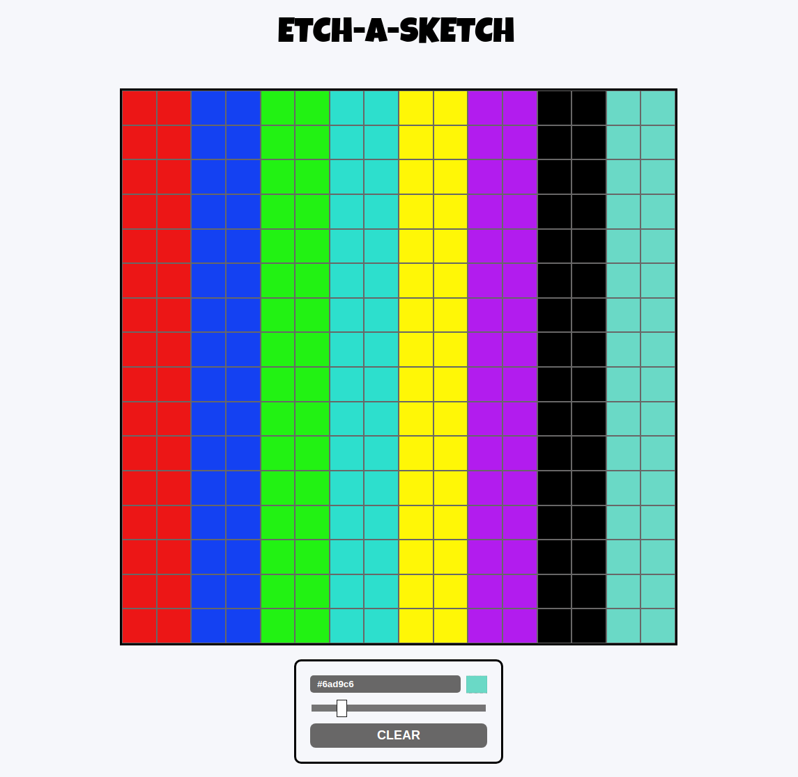

# Odin Project #4: Etch-a-Sketch

The goal of this Odin Project assignment was to create a browser version of Etch-a-Sketch. I used this https://github.com/mdbassit/Coloris to add the color picker functionality.

I started and finished this project in July 2022.

## Assignment

[The Odin Project - Foundations - #4 Etch-a-Sketch](https://www.theodinproject.com/lessons/foundations-etch-a-sketch)

## Technology

- HTML
- CSS
- Vanilla JavaScript

## Features

- Select a different color
- Clear the drawing
- Change the grid size with the slider

## Key Concepts

- DOM manipulation: querySelectorAll, getElementById and addEventListener
- JavaScript functions
- Chrome DevTools

## Links

[Live Demo](https://bn7631-odin-etch-a-sketch.pages.dev)

## Screenshots

### Desktop



## Deployment

```bash
  git clone https://github.com/BrightNeon7631/odin-etch-a-sketch.git
```
